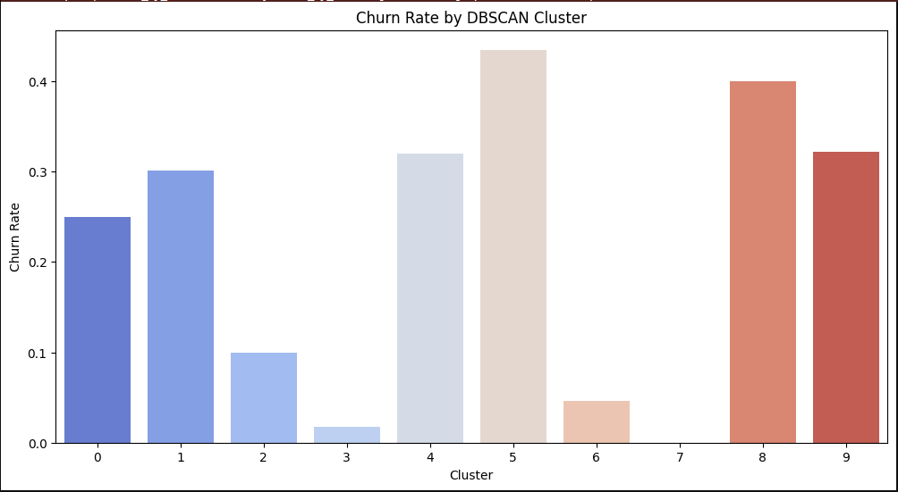

# Nonlinear Churn Detection via Entropy, UMAP, and Clustering

This repository contains a full data science pipeline for customer churn detection based on nonlinear feature engineering and topological analysis. The project demonstrates how to move beyond PCA and traditional models by combining information theory (entropy), nonlinear projection (UMAP), and density-based clustering (DBSCAN/HDBSCAN) to create a meaningful and explainable risk model.

---

## 🚀 Project Overview

Traditional churn prediction methods often rely on linear models or tree-based classifiers applied to structured data. But what happens when PCA fails to reveal clusters or separability?

This project answers that question by exploring customer behavior using entropy-based feature engineering and nonlinear manifold learning. The final outcome is a soft churn risk score derived from behavioral disorder, cluster risk, and membership fuzziness.

---

## 📊 Dataset

We use the [Telco Customer Churn Dataset](https://www.kaggle.com/datasets/blastchar/telco-customer-churn), which includes 7,043 customer records with features related to demographics, services, billing, and account information. The binary target is whether the customer churned.

---

## 🔍 Key Concepts

### ✨ Entropy as a Behavioral Signal
- Each customer row is interpreted as a distribution.
- We compute per-customer Shannon entropy to quantify behavioral irregularity.
- High entropy = more complex, atypical, or uncertain profiles.

### 🌐 Nonlinear Embedding with UMAP
- PCA failed to uncover churn patterns (see below).
- UMAP revealed clear geometric structure and clusters with differentiated churn risk.

### 🫠 Density-Based Clustering
- DBSCAN and HDBSCAN were applied in UMAP space.
- Cluster-wise churn rates varied dramatically.

### 🔢 Churn Risk Score
We define a soft risk score:

\[ R = \alpha H + \beta (1 - S) + \gamma C \]

Where:
- \( H \): Normalized entropy
- \( S \): HDBSCAN membership strength
- \( C \): Cluster-level churn rate

Customers in the top 5% of this score were flagged as **high risk**.

---

## 📈 Visual Highlights

### PCA Projection (Failed to Separate Churn)

### UMAP Projection (Clear Churn Clustering)

### DBSCAN Clusters in UMAP Space

### Churn Rate by Cluster

### Churn Risk Score Distribution

### Feature Importance for Risk Prediction

Note that **ShannonEntropy** emerged as a top feature, showing that information-theoretic metrics help surface structure invisible to PCA.

---

## 📚 Report
The full write-up is available as a LaTeX/PDF report in this repository:
- `churn_entropy_clustering_report.pdf`
- Includes mathematical detail, methodology evolution, and interpretability discussion.

---

## 🎯 Results
- PCA: visually ineffective for clustering churn behavior.
- Entropy + UMAP + DBSCAN: generated meaningful clusters with churn variability.
- Churn risk classifier trained on soft labels achieved strong accuracy.
- Visual tools are dashboard-ready (Power BI or similar).

---

## 📚 References
- [Telco Churn Dataset on Kaggle](https://www.kaggle.com/datasets/blastchar/telco-customer-churn)
- [Customer Churn ML GitHub Project](https://github.com/bobovski66/customer_churn_ML)

---

## 📅 Next Steps
- Visualize risk evolution over time.
- Use persistent homology or Mapper for richer topological summaries.
- Adapt the framework to other types of behavioral churn or fraud.

---

## 🎨 Final Thought
When PCA fails, measure entropy. Nonlinear structure is often visible through disorder before it emerges in variance.

---

Feel free to fork, reuse, or cite. Questions, feedback, and collaboration welcome!

